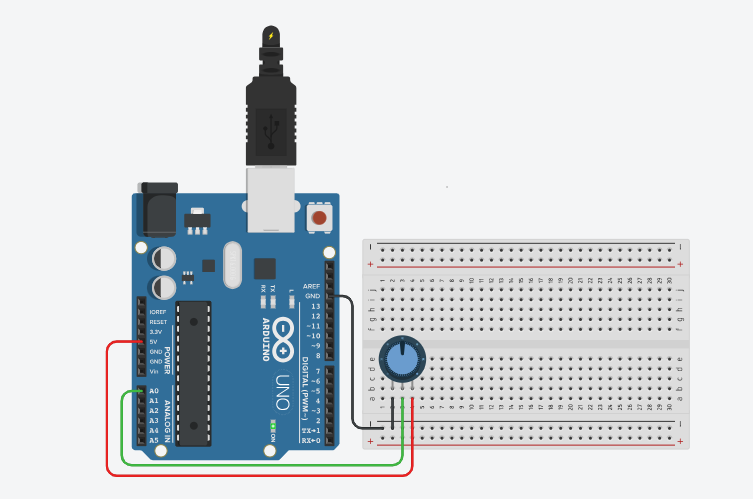

# Lendo um potenciometro
 Este experimento consistem em fazer a leitura do potenciômetro conectado a porta analógica 0 e escreveremos o valor lido no monitor serial. 
 
## Lista de componentes:

- 1  Arduíno UNO R3
- 1  Um cabo de conexão USB
- 1  Placa de prototipação (Protoboard)
- 1  Potenciômetro 
- 5 Jumpers (macho-macho)

<b><a href="https://www.tinkercad.com/things/lNr5WcQx7it">Clique Aqui</a></b> Para vero o projeto no Tinkercard!

## Esquema do projeto

